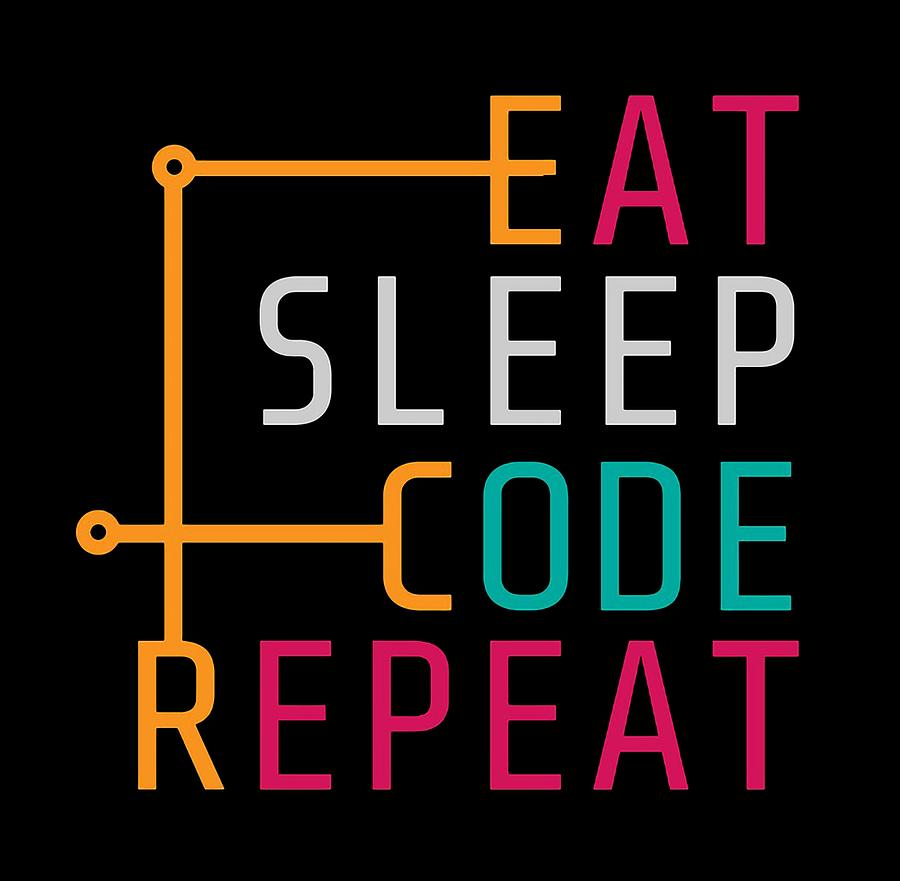

    

**Hello Developers**

I’m **Jamal Veve**, a **Full-Stack Engineer** with 2+ years of end-to-end software development experience, specializing in **Java**, **Spring Boot**, **JavaScript**, **SQL**, and modern web technologies. I love turning complex problems into scalable, elegant solutions.

---
<h2>
  About Me
  
</h2>

🎓 Graduated from [Info Institute of Engineering](https://infoengg.com/)  
🔍 Passionate about **problem solving** and clean code  
🔭 Currently working as a **Full-Stack Developer**  
🌱 Obsessed with **Data Structures & Algorithms**  
🤝 Open to **freelancing, open-source contributions**, and collab projects  
💬 Let’s talk: **Java | Spring Boot | SQL | React | AI Workflows**

---
<h2>
  What I do?
  
</h2>

* Build and deploy **scalable web applications**, from REST APIs to rich front-end experiences
* Integrate robust **back-end logic with efficient database design** (SQL, MySQL)
* Own features end-to-end—from design, coding, testing, to deployment and performance tuning
* Write **clean, reusable code** in JavaScript (React) and Java (Spring Boot)

---
<h2>🧰 Tech Stack & Tools </h2>

---

### **🎯 My Focus Areas**

* **AI-Enhanced Development & Automation**
  Continuously integrating AI tools (ChatGPT, Gemini, LangChain) into workflows—for smarter development, code generation, data pipelines, and feature engineering

* **Data & SQL for AI Workflows**
  Applying SQL best practices to build clean, AI-ready datasets—whether it’s querying Sakila, aggregating logs, or preparing ML features

* **Full-Stack System Thinking**
  Connecting user experience with back-end logic and data—ensuring every part of the stack contributes to scalable, maintainable products

---

### **🌱 What I’m Learning**

* Mastering ** Data Structures,SQL joins, subqueries, and CTEs** to enrich data for AI models
* Experimenting with **end-to-end AI pipelines**: EDA → SQL → feature engineering → model build → deployment
* Exploring **prompt engineering + AI copilots** to streamline software development and debug faster

---

<h2>

 GitHub Stats
</h2>

  
  
  

---

 **Let's Connect**

Interested? I’d love to connect. Check out my work on GitHub: [github.com/jamalveve](https://github.com/jamalveve) and feel free to reach out anytime!

  

  
  
  

⭐️ *“Code is poetry. Build things that matter.”*

